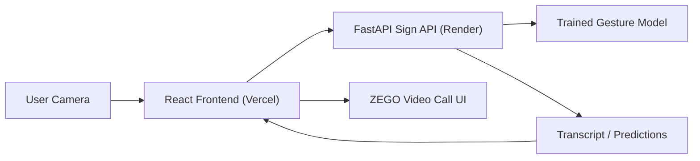

# SignBridge: Sign Language Conversation Video Call

SignBridge combines a React video-call interface with a Python sign-language interpreter. It is designed as a demo-friendly accessibility project: join a call, run live sign recognition, show real-time captions, and optionally speak the transcript back with a more natural browser voice.

## What this project includes

- `Code/`
  - FastAPI backend for sign recognition
  - trained word-level gesture model
  - webcam testing script
  - training pipeline for the provided gesture dataset
- `lang_video_call/`
  - React + Vite video-call UI
  - live caption panel
  - transcript speech button
  - deployment-ready Vercel config

## Current model scope

The current model is trained on the provided gesture vocabulary:

- `46` word classes
- `410` total gesture videos
- word-level recognition, not alphabet-by-alphabet spelling

The latest training pipeline uses:

- MediaPipe hand landmarks
- motion-aware sequence features
- data augmentation for small datasets
- GRU + attention sequence classification

## Repository structure

```text
Sign_language_conversation_video_call/
├── Code/
│   ├── sign_language_api.py
│   ├── sign_language_core.py
│   ├── sign_language_webcam.py
│   ├── train_sign_model.py
│   ├── collect_landmark.py
│   ├── final.py
│   ├── word_dataset.py
│   ├── sign_language_word_model.keras
│   └── requirements.txt
├── lang_video_call/
│   ├── src/
│   ├── public/
│   ├── package.json
│   ├── vercel.json
│   └── .env.example
└── render.yaml
```

## Architecture



## Local setup

### 1. Clone the repository

```powershell
git clone https://github.com/everthingisnotfound/Sign_language_conversation_video_call.git
cd Sign_language_conversation_video_call
```

### 2. Run the Python backend

```powershell
cd Code
python -m venv .venv
.\.venv\Scripts\python.exe -m pip install --upgrade pip
.\.venv\Scripts\python.exe -m pip install -r requirements.txt
.\.venv\Scripts\python.exe sign_language_api.py
```

Backend health check:

- [http://127.0.0.1:8000/api/health](http://127.0.0.1:8000/api/health)

### 3. Run the React frontend

Create `lang_video_call/.env` from `lang_video_call/.env.example`.

```powershell
cd ..\lang_video_call
npm install
npm run dev
```

Frontend dev URL:

- [http://127.0.0.1:5173](http://127.0.0.1:5173)

## Environment variables

### Frontend: `lang_video_call/.env`

```env
VITE_SIGN_API_URL=http://127.0.0.1:8000
VITE_ZEGO_APP_ID=your_zego_app_id
VITE_ZEGO_SERVER_SECRET=your_zego_server_secret
```

### Backend: Render or local env

```env
SIGN_API_HOST=0.0.0.0
SIGN_API_PORT=8000
SIGN_API_ORIGINS=https://your-frontend-domain.vercel.app,http://localhost:5173
```

## Webcam-only testing

If you want to test recognition locally without the web app:

```powershell
cd Code
.\.venv\Scripts\python.exe sign_language_webcam.py
```

Controls:

- `S` speak transcript
- `C` clear transcript
- `Q` quit

## Retraining the model

If you re-add the `gestures/` dataset locally and want to retrain:

```powershell
cd Code
.\.venv\Scripts\python.exe final.py
```

This pipeline will:

1. extract landmarks from gesture videos
2. build train/test splits
3. train the word-level model
4. save `sign_language_word_model.keras`

## Deployment recommendation

### Best choice for this project

Use:

- `Vercel` for the React frontend
- `Render` for the Python FastAPI backend

### Why not GitHub Pages?

GitHub Pages is for static sites only, so it can host the React build output but not the Python inference API. GitHub’s docs describe Pages as a static site hosting service for HTML, CSS, and JavaScript files.

### Why not host the backend on Vercel or Netlify?

The frontend can deploy fine there, but this backend loads TensorFlow, OpenCV, and MediaPipe for word-sequence inference. In practice, a normal container-based Python service is a better fit than a serverless-style deployment for this model.

## Deploy the backend on Render

This repository includes:

- [render.yaml](./render.yaml)
- [Code/Dockerfile](./Code/Dockerfile)
- [Code/.dockerignore](./Code/.dockerignore)

### Render steps

1. Push this repo to GitHub.
2. Open [Render](https://render.com/docs/web-services).
3. Create a new Web Service from the GitHub repo.
4. Choose the `render.yaml` blueprint or create the service manually.
5. Set:
   - service type: `Web Service`
   - runtime: `Docker`
6. Add env vars:
   - `SIGN_API_HOST=0.0.0.0`
   - `SIGN_API_PORT=8000`
   - `SIGN_API_ORIGINS=https://your-vercel-domain.vercel.app`
7. Deploy.

After deployment, your backend URL will look like:

- `https://your-api-name.onrender.com`

Health check:

- `https://your-api-name.onrender.com/api/health`

## Deploy the frontend on Vercel

This repository includes:

- [lang_video_call/vercel.json](./lang_video_call/vercel.json)

That file ensures client-side routes like `/room/:id` work correctly on refresh.

### Vercel steps

1. Open [Vercel](https://vercel.com/docs/frameworks/frontend/vite).
2. Import this GitHub repository.
3. Set the project root directory to:

```text
lang_video_call
```

4. Add environment variables in Vercel:

```env
VITE_SIGN_API_URL=https://your-api-name.onrender.com
VITE_ZEGO_APP_ID=your_zego_app_id
VITE_ZEGO_SERVER_SECRET=your_zego_server_secret
```

5. Deploy.

Your frontend URL will look like:

- `https://your-project-name.vercel.app`

## Important production note

The current frontend uses `VITE_ZEGO_SERVER_SECRET`, which means the ZEGO secret is exposed to the browser at build time. This is acceptable for a demo or personal project, but not ideal for a production-grade app.

For a safer production setup, move token generation to the backend and keep the ZEGO server secret server-side only.

## Demo deployment checklist

Before sharing the app across devices:

- backend deployed and `/api/health` works
- frontend deployed on Vercel
- `VITE_SIGN_API_URL` points to the Render backend
- `SIGN_API_ORIGINS` includes the Vercel frontend domain
- ZEGO env vars configured
- browser camera permissions allowed

## Notes and limitations

- The model is much better than the original baseline, but still limited by dataset size.
- The dataset itself is not stored in GitHub in this repo.
- The included model files are enough for inference without retraining.
- Webcam recognition and web recognition share the same trained model.
- Speech on the website uses the device browser’s available voices, so voice quality depends on the device and browser.

## References

- GitHub Pages overview: [GitHub Docs](https://docs.github.com/articles/using-a-static-site-generator-other-than-jekyll)
- Vite on Vercel: [Vercel Docs](https://vercel.com/docs/frameworks/frontend/vite)
- Docker on Render: [Render Docs](https://render.com/docs/docker)
- Render Web Services: [Render Docs](https://render.com/docs/web-services)
